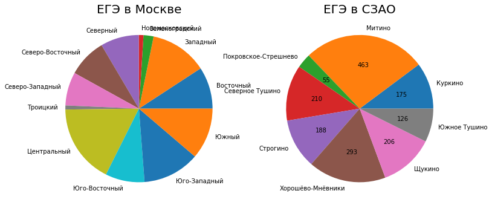
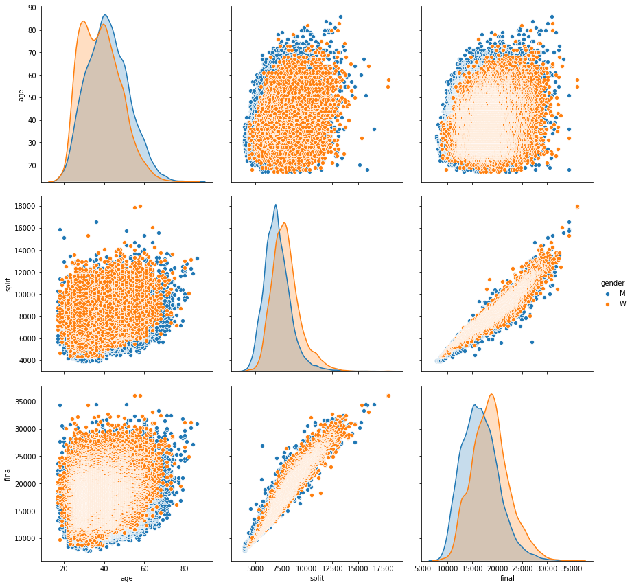
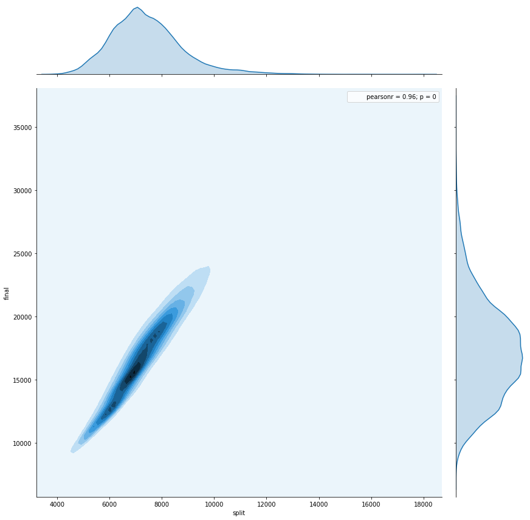
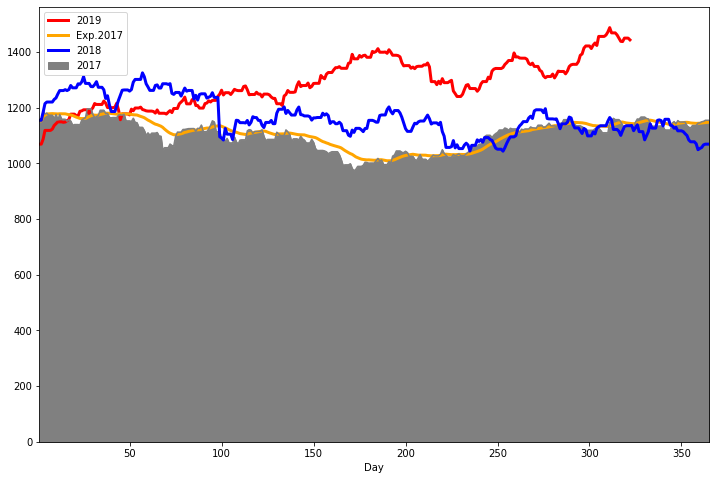
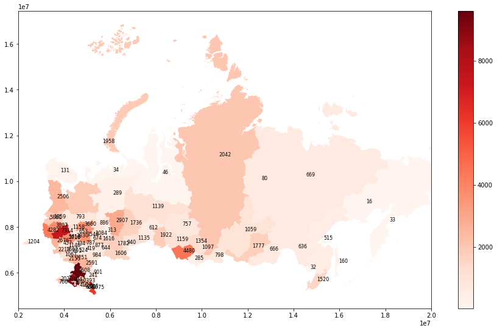
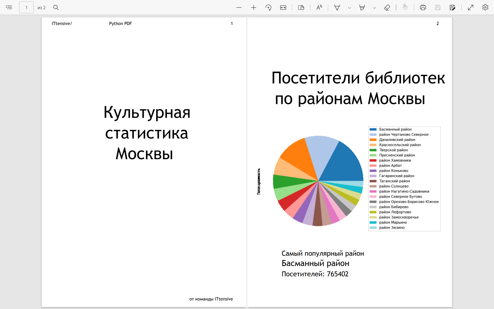
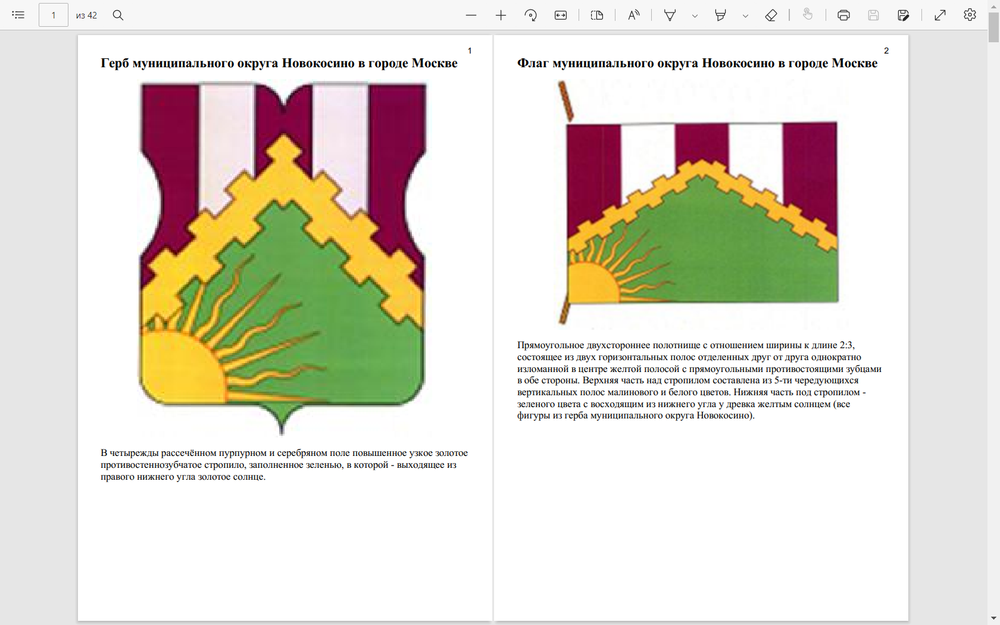
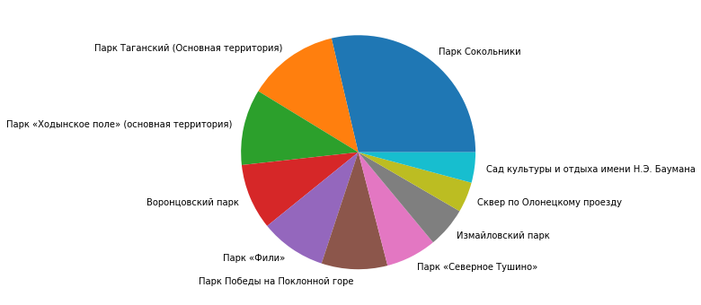
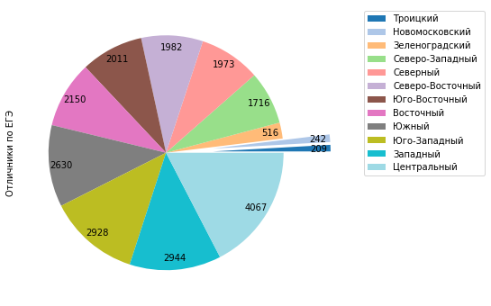

#Курс
# Продвинутый Python
## Портфолио по анализу данных
---
## Часть 1 Анализ данных.   numpy и pandas
###  Задание: импорт данных

Возьмите данные по вызовам пожарных служб в Москве за 2015-2019 годы:
https://video.ittensive.com/python-advanced/data-5283-2019-10-04.utf.csv
Получите из них фрейм данных (таблицу значений). По этому фрейму вычислите среднее значение вызовов пожарных машин в месяц в одном округе Москвы, округлив до целых
_Примечание: найдите среднее значение вызовов, без учета года_

     Решение:    
>import pandas as pd
data = pd.read_csv("https://video.ittensive.com/python-advanced/data-5283-2019-10-04.utf.csv", delimiter=";")
print (data["Calls"].mean().round())

>493.0
--- 

## Часть 1 Анализ данных.   Индексы и объединение фреймов
###  Задание: данные из нескольких источников
Получите данные по безработице в Москве:
https://video.ittensive.com/python-advanced/data-9753-2019-07-25.utf.csv
Объедините эти данные индексами (Месяц/Год) с данными из предыдущего задания (вызовы пожарных) для Центральный административный округ:
https://video.ittensive.com/python-advanced/data-5283-2019-10-04.utf.csv
Найдите значение поля UnemployedMen в том месяце, когда было меньше всего вызовов в Центральном административном округе.

    Решение:    
>import pandas as pd
data1 = pd.read_csv("https://video.ittensive.com/python-advanced/data-9753-2019-07-25.utf.csv", delimiter=";")
data1 = data1.set_index(["Year", "Period"])
data2 = pd.read_csv("https://video.ittensive.com/python-advanced/data-5283-2019-10-04.utf.csv", delimiter=";")
data2 = data2.set_index(["AdmArea", "Year", "Month"])
data2 = data2.loc["Центральный административный округ"]
data2.index.names = ["Year", "Period"]
data = pd.merge(data1, data2, left_index=True, right_index=True)
data = data.reset_index()
data = data.set_index("Calls")
data = data.sort_index()
print (data["UnemployedMen"][0:1])

>Calls
220    13465
Name: UnemployedMen, dtype: int64
--- 
## Часть 1 Анализ данных.   Линейная регрессия
## Задание: предсказание на 2020 год
Возьмите данные по безработице в городе Москва:
video.ittensive.com/python-advanced/data-9753-2019-07-25.utf.csv
Сгруппируйте данные по годам, и, если в году меньше 6 значений, отбросьте эти годы.
Постройте модель линейной регрессии по годам среднего значения отношения UnemployedDisabled к UnemployedTotal (процента людей с ограниченными возможностями) за месяц и ответьте, какое ожидается значение процента безработных инвалидов в 2020 году при сохранении текущей политики города Москвы?
Ответ округлите до сотых. Например, 2,32

  Решение:    
>import pandas as pd
import numpy as np
from sklearn.linear_model import LinearRegression
data = pd.read_csv("https://video.ittensive.com/python-advanced/data-9753-2019-07-25.utf.csv", delimiter=";")
data["UDP"] = 100*data["UnemployedDisabled"]/data["UnemployedTotal"]
data_group = data.groupby("Year").filter(lambda x: x["UDP"].count() > 5)
data_group = data_group.groupby("Year").mean()
x = np.array(data_group.index).reshape(len(data_group.index), 1)
y = np.array(data_group["UDP"]).reshape(len(data_group.index), 1)
model = LinearRegression()
model.fit(x, y)
print (np.round(model.predict(np.array(2020).reshape(1, 1)), 2))

>[[1.52]]
---
## Часть 1 Анализ данных.   Фильтрация и изменение данных
## Задание: выделение данных
Получите данные по безработице в Москве:
https://video.ittensive.com/python-advanced/data-9753-2019-07-25.utf.csv
Найдите, с какого года процент людей с ограниченными возможностями (UnemployedDisabled) среди всех безработных (UnemployedTotal) стал меньше 2%.

    Решение:    
>import pandas as pd
data = pd.read_csv("https://video.ittensive.com/python-advanced/data-9753-2019-07-25.utf.csv", delimiter=";")
data["Sum"] = data.apply(lambda x: 100*x[6]/x[7], axis=1)
data = data[data["Sum"] < 2]
data = data.set_index("Year")
data = data.sort_index()
print (data.index[0:1])
>Int64Index([2018], dtype='int64', name='Year')
---
## Часть 2 Импорт и парсинг данных
## 2.1 Импорт данных
Задание: получение данных по API
Изучите API Геокодера Яндекса
tech.yandex.ru/maps/geocoder/doc/desc/concepts/input_params-docpage/
и получите ключ API для него в кабинете разработчика.
Выполните запрос к API и узнайте долготу точки на карте (Point) для города Самара.
Внимание: активация ключа Геокодера Яндекса может занимать несколько часов (до суток).
В качестве запасного варианта можно использовать этот ключ - 3f355b88-81e9-4bbf-a0a4-eb687fdea256 - он только для выполнения этого задания!

   Решение:    
>import requests
import pandas as pd
import json
r = requests.get("https://geocode-maps.yandex.ru/1.x?geocode=Самара&apikey=3f355b88-81e9-4bbf-a0a4-eb687fdea256&format=json&results=1")
geo = json.loads(r.content)
#print(geo)
print(geo['response']['GeoObjectCollection']['featureMember'][0]['GeoObject']['Point']['pos'].split(" ")[0])

>{'response': {'GeoObjectCollection': {'metaDataProperty': {'GeocoderResponseMetaData': {'request': 'Самара', 'results': '1', 'found': '1'}}, 'featureMember': [{'GeoObject': {'metaDataProperty': {'GeocoderMetaData': {'precision': 'other', 'text': 'Россия, Самара', 'kind': 'locality', 'Address': {'country_code': 'RU', 'formatted': 'Россия, Самара', 'Components': [{'kind': 'country', 'name': 'Россия'}, {'kind': 'province', 'name': 'Приволжский федеральный округ'}, {'kind': 'province', 'name': 'Самарская область'}, {'kind': 'area', 'name': 'городской округ Самара'}, {'kind': 'locality', 'name': 'Самара'}]}, 'AddressDetails': {'Country': {'AddressLine': 'Россия, Самара', 'CountryNameCode': 'RU', 'CountryName': 'Россия', 'AdministrativeArea': {'AdministrativeAreaName': 'Самарская область', 'SubAdministrativeArea': {'SubAdministrativeAreaName': 'городской округ Самара', 'Locality': {'LocalityName': 'Самара'}}}}}}}, 'name': 'Самара', 'description': 'Россия', 'boundedBy': {'Envelope': {'lowerCorner': '49.732198 53.091785', 'upperCorner': '50.390439 53.551185'}}, 'Point': {'pos': '50.100202 53.195878'}}}]}}}

>50.100202
---

## Часть 2 Импорт и парсинг данных
## Задание: 2.2 Парсинг данных, получение котировок акций
Получите данные по котировкам акций со страницы:
mfd.ru/marketdata/?id=5&group=16&mode=3&sortHeader=name&sortOrder=1&selectedDate=01.11.2019
и найдите, по какому тикеру был максимальный рост числа сделок (в процентах) за 1 ноября 2019 года.

   Решение:    
>import requests
import pandas as pd
from bs4 import BeautifulSoup
r = requests.get("https://mfd.ru/marketdata/?id=5&group=16&mode=3&sortHeader=name&sortOrder=1&selectedDate=01.11.2019")
html = BeautifulSoup(r.content)
table = html.find('table', {'id':'marketDataList'})
rows = []
trs = table.find_all('tr')
for tr in trs:
    tr = [td.get_text(strip=True) for td in tr.find_all('td')]
    if len(tr) > 0:
        rows.append(tr)
data = pd.DataFrame(rows, columns=["Тикер", "Дата", "Сделки", "C/рост", "С/%", "Закрытие", "Открытие", "min", "max", "avg", "шт", "руб", "Всего"])
data = data[data["Сделки"] != "N/A"]
data["С/%"] = data["С/%"].str.replace("−","-").str.replace("%","").astype(float)
data = data.set_index("С/%")
data = data.sort_index(ascending=False)
print (data["Тикер"].head(1))

>С/%
11.0    ИКРУСС-ИНВ
Name: Тикер, dtype: object
---
## Часть 2 Импорт и парсинг данных
## 2.3 Веб-скрепинг
## Задание: парсинг интернет-магазина
Используя парсинг данных с маркетплейса beru.ru, найдите, на сколько литров отличается общий объем холодильников Саратов 263 и Саратов 452?
Для парсинга можно использовать зеркало страницы beru.ru с результатами для холодильников Саратов по адресу:
video.ittensive.com/data/018-python-advanced/beru.ru/

   Решение:    
>import requests
from bs4 import BeautifulSoup
headers = {"User-Agent": "Mozilla/5.0 (Windows NT 6.1; WOW64) AppleWebKit/537.36 (KHTML, like Gecko) Chrome/78.0.3904.97 YaBrowser/19.12.0.358 Yowser/2.5 Safari/537.36"}
r = requests.get("https://beru.ru/search?cvredirect=2&suggest_reqId=27865074762321487883702093457804&text=%D1%81%D0%B0%D1%80%D0%B0%D1%82%D0%BE%D0%B2", headers=headers)
html = BeautifulSoup(r.content)
print (r.content)
links = html.find_all("a", {"class": "grid-snippet__react-link"})
link_263 = ''
link_452 = ''
for link in links:
    if str(link).find("Саратов 263") > -1:
        link_263 = link["href"]
    if str(link).find("Саратов 452") > -1:
        link_452 = link["href"]
>
>def find_volume (link):
    r = requests.get("https://beru.ru" + link)
    html = BeautifulSoup(r.content)
    volume = html.find_all("span", {"class": "_112Tad-7AP"})
    return int(''.join(i for i in volume[2].get_text() if i.isdigit()))
>
>if link_263 and link_452:
    volume_263 = find_volume(link_263)
    volume_452 = find_volume(link_452)
    diff = max(volume_263, volume_452) - min(volume_263, volume_452)
    print (diff)

>73
---
## Часть 2 Импорт и парсинг данных
## 2.4 Работа с SQL
## Задание: загрузка результатов в БД
Соберите данные о моделях холодильников Саратов с маркетплейса beru.ru: URL, название, цена, размеры, общий объем, объем холодильной камеры.
Создайте соответствующие таблицы в SQLite базе данных и загрузите полученные данные в таблицу beru_goods.
Для парсинга можно использовать зеркало страницы beru.ru с результатами для холодильников Саратов по адресу:
video.ittensive.com/data/018-python-advanced/beru.ru/

   Решение:    
>import sqlite3
import requests
from bs4 import BeautifulSoup
>
>def find_number(text):
    return int("0" + "".join(i for i in text if i.isdigit()))
def find_data (link):
    r = requests.get("https://beru.ru" + link)
    html = BeautifulSoup(r.content)
    title = html.find("h1", {"class": "_3TfWusA7bt"}).get_text()
    price = find_number(html.find("span", {"data-tid": "c3eaad93"}).get_text())
    tags = html.find_all("span", {"class": "_112Tad-7AP"})
    width = 0
    depth = 0
    height = 0
    volume = 0
    freezer = 0
    for tag in tags:
        tag = tag.get_text()
        if tag.find("ШхВхГ") > -1:
            dims = tag.split(":")[1].split("х")
            width = float(dims[0])
            depth = float(dims[1])
            height = float(dims[2].split(" ")[0])
        if tag.find("общий объем") > -1:
            volume = find_number(tag)
        if tag.find("объем холодильной камеры") > -1:
            freezer = find_number(tag)
    return [link, title, price, width, depth, height, volume, freezer]
>
>ist?cvredirect=3&suggest_reqId=83526016473955609954771572320629&text=%D0%A1%D0%B0%D1%80%D0%B0%D1%82%D0%BE%D0%B2")
html = BeautifulSoup(r.content)
links = html.find_all("a", {"class": "grid-snippet__react-link"})
data = []
for link in links:
    if link["href"] and link.get_text().find("Саратов") > -1:
        data.append(find_data(link["href"]))
conn = sqlite3.connect("sqlite/data.db3")
db = conn.cursor()
db.execute("""CREATE TABLE beru_goods
            (id INTEGER PRIMARY KEY AUTOINCREMENT not null,
            url text,
            title text default '',
            price INTEGER default 0,
            width FLOAT default 0.0,
            depth FLOAT default 0.0,
            height FLOAT default 0.0,
            volume INTEGER default 0,
            freezer INTEGER default 0)""")
conn.commit()
db.executemany("""INSERT INTO beru_goods (url, title, price, width, depth, height, volume, freezer)
           VALUES (?, ?, ?, ?, ?, ?, ?, ?)""", data)
conn.commit()
print (db.execute("SELECT * FROM beru_goods").fetchall())
db.close()

>data.db3
---
## Часть 3 Визуализация данных
## 3.1 Основы Matplotlib
## Задание: тип визуализации данных
Загрузите данные по ЕГЭ за последние годы
https://video.ittensive.com/python-advanced/data-9722-2019-10-14.utf.csv
выберите данные за 2018-2019 учебный год.
Выберите тип диаграммы для отображения результатов по административному округу Москвы, постройте выбранную диаграмму для количества школьников, написавших ЕГЭ на 220 баллов и выше.
Выберите тип диаграммы и постройте ее для районов Северо-Западного административного округа Москвы для количества школьников, написавших ЕГЭ на 220 баллов и выше.

 Решение:
 >    
>%matplotlib inline
import pandas as pd
import matplotlib.pyplot as plt
data = pd.read_csv("https://video.ittensive.com/python-advanced/data-9722-2019-10-14.utf.csv", delimiter=";")
data["District"] = data["District"].str.replace("район ","").astype("category")
data["AdmArea"] = data["AdmArea"].apply(lambda x:x.split(" ")[0]).astype("category")
data = data.set_index("YEAR").loc["2018-2019"].reset_index()
>
>fig = plt.figure(figsize=(12,12))
area = fig.add_subplot(1, 2, 1)
area.set_title("ЕГЭ в Москве", fontsize=20)
data_adm = data.set_index("AdmArea")
data_adm["PASSES_OVER_220"].groupby("AdmArea").sum().plot.pie(ax=area, label="")
>
>area = fig.add_subplot(1, 2, 2)
area.set_title("ЕГЭ в СЗАО", fontsize=20)
data_district = data_adm.loc["Северо-Западный"].reset_index().set_index("District")
data_district = data_district["PASSES_OVER_220"].groupby("District").sum()
total = sum(data_district)
data_district.plot.pie(ax=area, label="", autopct=lambda x:int(round(total * x/100)))
plt.show()

>District
Куркино                 175
Митино                  463
Покровское-Стрешнево     55
Северное Тушино         210
Строгино                188
Хорошёво-Мнёвники       293
Щукино                  206
Южное Тушино            126
Name: PASSES_OVER_220, dtype: int64

---
## Часть 3 Визуализация данных
## 3.2 Визуализация зависимостей
## Задание: результаты марафона
Загрузите данные по итогам марафона
https://video.ittensive.com/python-advanced/marathon-data.csv
Приведите время половины и полной дистанции к секундам.
Найдите, данные каких серии данных коррелируют (используя диаграмму pairplot в Seaborn).
Найдите коэффициент корреляции этих серий данных, используя scipy.stats.pearsonr.
Постройте график jointplot для коррелирующих данных.

Решение:
 >  %matplotlib inline
import matplotlib.pyplot as plt
import seaborn as sns
import pandas as pd
import scipy.stats as stats
>
>def convert_time(a):
    return sum(x*int(t) for x,t in zip([3600, 60, 1], a.split(":" )))
>
>data = pd.read_csv("https://video.ittensive.com/python-advanced/.marathon-data.csv")
data["split"] = data["split"].apply(convert_time)
data["final"] = data["final"].apply(convert_time)
sns.pairplot(data, hue="gender", height=4)
plt.show()
sns.jointplot("split", "final", data, height=12, kind="kde").annotate(stats.pearsonr)
plt.show()
print (round(stats.pearsonr(data["split"], data["final"])[0], 2))

>0.96

---
## Часть 3 Визуализация данных
## 3.3 Временные ряды
## Задание: скользящие средние на биржевых графиках
Используя данные индекса РТС за последние годы
https://video.ittensive.com/python-advanced/rts-index.csv
постройте отдельные графики закрытия (Close) индекса по дням за 2017, 2018, 2019 годы в единой оси X.
Добавьте на график экспоненциальное среднее за 20 дней для значения Max за 2017 год.
Найдите последнюю дату, когда экспоненциальное среднее максимального дневного значения (Max) в 2017 году было больше, чем соответствующее значение Close в 2019 году (это последнее пересечение графика за 2019 год и графика для среднего за 2017 год).
Решение:
 > %matplotlib inline
import pandas as pd
import matplotlib.pyplot as plt
>
>data = pd.read_csv("https://video.ittensive.com/python-advanced/rts-index.csv")
data["Date"] = pd.to_datetime(data["Date"], dayfirst=True)
dates = pd.date_range(min(data["Date"]), max(data["Date"]))
data = data.set_index("Date")
data = data.reindex(dates).ffill()
data["Day"] = pd.to_datetime(data.index).dayofyear
data.index.name = "Date"
data = data.sort_index()
data_2019 = data["2019"].reset_index().set_index("Day")
data_2017 = data["2017"].reset_index().set_index("Day")["Max"].ewm(span=20).mean()
>
>fig = plt.figure(figsize=(12,8))
area = fig.add_subplot(1, 1, 1)
data_2019["Close"].plot(ax=area, color="red", label="2019", lw=3)
data_2017.plot(ax=area, color="orange", label="Exp.2017", lw=3)
data["2017"].reset_index().set_index("Day")["Close"].plot.area(ax=area, color=".5", label="2017")
data["2018"].reset_index().set_index("Day")["Close"].plot(ax=area, color="blue", label="2018", lw=3)
plt.legend()
plt.show()
data_fall = data_2019[data_2019["Close"] < data_2017[0:len(data_2019)]]
data_fall.set_index("Date", inplace=True)
data_fall = data_fall.sort_index(ascending=False)
print (data_fall.head(1).index)

>DatetimeIndex(['2019-02-19'], dtype='datetime64[ns]', name='Date', freq=None)

---
## Часть 3 Визуализация данных
## 3.4 Гео-данные и картограммы
## Задание: объекты культурного наследия России
Изучите набор данных по объектам культурного наследия России (в виде gz-архива):
https://video.ittensive.com/python-advanced/data-44-structure-4.csv.gz
и постройте фоновую картограмму по количеству объектов в каждом регионе России, используя гео-данные
https://video.ittensive.com/python-advanced/russia.json
Выведите для каждого региона количество объектов в нем.
Посчитайте число объектов культурного наследия в Татарстане.
Решение:
 >%matplotlib inline
import matplotlib.pyplot as plt
import geopandas as gpd
import pandas as pd
import descartes
>
>data = pd.read_csv("data-44-structure-4.csv.gz", usecols=["Объект","Регион"])
data["Регион"] = data["Регион"].str.upper()
data = data.groupby("Регион").count()
>#/print (data.index.values)
>
>geo = gpd.read_file("russia.json")
geo = geo.to_crs({"init": 'epsg:3857'})
geo["NL_NAME_1"] = geo["NL_NAME_1"].str.upper()
geo = geo.replace({
    "ХАНТЫ-МАНСИЙСКИЙ АВТОНОМНЫЙ ОКРУГ": "ХАНТЫ-МАНСИЙСКИЙ АВТОНОМНЫЙ ОКРУГ - ЮГРА",
    "РЕСПУБЛИКА АДЫГЕЯ": "РЕСПУБЛИКА АДЫГЕЯ (АДЫГЕЯ)",
    "ЧУВАШСКАЯ РЕСПУБЛИКА": "ЧУВАШСКАЯ РЕСПУБЛИКА - ЧУВАШИЯ",
    "РЕСПУБЛИКА МАРИЙ-ЭЛ": "РЕСПУБЛИКА МАРИЙ ЭЛ",
    "РЕСПУБЛИКА СЕВЕРНАЯ ОСЕТИЯ": "РЕСПУБЛИКА СЕВЕРНАЯ ОСЕТИЯ - АЛАНИЯ",
    "РЕСПУБЛИКА ТАТАРСТАН": "РЕСПУБЛИКА ТАТАРСТАН (ТАТАРСТАН)"
})
geo = pd.merge(left=geo, right=data,
              left_on="NL_NAME_1", right_on="Регион", how="left")
>#print (geo[geo["Объект"].isnull()])
fig = plt.figure(figsize=(16,9))
area = plt.subplot(1, 1, 1)
geo.plot(ax=area, legend=True, column="Объект", cmap="Reds")
area.set_xlim(2e6, 2e7)
for _, region in geo.iterrows():
    area.annotate(region["Объект"],
                 xy=(region.geometry.centroid.x,
                    region.geometry.centroid.y), fontsize=8)
plt.show()
print (geo[geo["NL_NAME_1"] == "АЛТАЙСКИЙ КРАЙ"]["Объект"])

>11    4480
Name: Объект, dtype: int64

---
## Часть 4 Отчеты и автоматизация
## 4.1 Работа с PDF 
## Задание: сборка PDF документа
Используя данные по посещаемости библиотек в районах Москвы
https://video.ittensive.com/python-advanced/data-7361-2019-11-28.utf.json
постройте круговую диаграмму суммарной посещаемости (NumOfVisitors) 20 наиболее популярных районов Москвы.
Создайте PDF отчет, используя файл
https://video.ittensive.com/python-advanced/title.pdf
как первую страницу. На второй странице выведите итоговую диаграмму, самый популярный район Москвы и число посетителей библиотек в нем.
Решение:
 >%matplotlib inline
from reportlab.pdfgen import canvas
from reportlab.lib import pagesizes
from reportlab.pdfbase import pdfmetrics
from reportlab.pdfbase.ttfonts import TTFont
from reportlab.lib.utils import ImageReader
from PyPDF2 import PdfFileMerger, PdfFileReader
import requests
import json
import pandas as pd
import matplotlib.pyplot as plt
import seaborn as sns
>
>def extract_district (x):
    return list(map(lambda a: a["District"], x))[0]
>
>r = requests.get("https://video.ittensive.com/python-advanced/data-7361-2019-11-28.utf.json")
data = pd.DataFrame(json.loads(r.content)).fillna(value=0)
data["District"] = data["ObjectAddress"].apply(extract_district)
data_sum = data.groupby("District").sum().sort_values("NumOfVisitors",
                                                     ascending=False)
fig = plt.figure(figsize=(11,6))
area = fig.add_subplot(1, 1, 1)
data_sum[0:20]["NumOfVisitors"].plot.pie(ax = area,
                                        labels=[""]*20,
                                        label="Посещаемость",
                                        cmap="tab20")
>plt.legend(data_sum[0:20].index,
          bbox_to_anchor=(1.5,1,0.1,0))
plt.savefig("readers.png")
>#plt.show()
>#print(data_sum)
pdfmetrics.registerFont(TTFont("Trebuchet", "Trebuchet.ttf"))
PDF = canvas.Canvas("readers.pdf", pagesize=pagesizes.A4)
PDF.setFont("Trebuchet", 48)
PDF.drawString(70, 650, "Посетители библиотек")
PDF.drawString(80, 590, "по районам Москвы")
PDF.setFont("Trebuchet", 13)
PDF.drawString(550, 820, "2")
PDF.drawImage(ImageReader("readers.png"), -200, 150)
PDF.setFont("Trebuchet", 20)
PDF.drawString(100, 150, "Самый популярный район")
PDF.setFont("Trebuchet", 24)
PDF.drawString(100, 120, data_sum.index.values[0])  # что-то пошло не так  
PDF.setFont("Trebuchet", 20)
PDF.drawString(100, 90,
               "Посетителей: " + str(int(data_sum["NumOfVisitors"].values[0])))
PDF.save()
files = ["title.pdf", "readers.pdf"]
merger = PdfFileMerger()
for filename in files:
    merger.append(PdfFileReader(open(filename, "rb")))
merger.write("report.pdf")
 

---
## Часть 4 Отчеты и автоматизация
## 4.2 Базовые отчеты
## Задание: геральдические символы Москвы
Сгенерируйте PDF документ из списка флагов и гербов районов Москвы:
https://video.ittensive.com/python-advanced/data-102743-2019-11-13.utf.csv
На каждой странице документа выведите название геральдического символа (Name), его описание (Description) и его изображение (Picture).
Для показа изображений используйте адрес
https://op.mos.ru/MEDIA/showFile?id=XXX
где XXX - это значение поля Picture в наборе данных. Например:
https://op.mos.ru/MEDIA/showFile?id=8466da35-6801-41a9-a71e-04b60408accb
В случае возникновения проблем с загрузкой изображений с op.mos.ru можно добавить в код настройку для форсирования использования дополнительных видов шифрования в протоколе SSL/TLS
>requests.packages.urllib3.util.ssl_.DEFAULT_CIPHERS = 'ALL:@SECLEVEL=1'

Решение:
 >import pandas as pd
import pdfkit
data = pd.read_csv("https://video.ittensive.com/python-advanced/data-102743-2019-11-13.utf.csv", delimiter=";")
>...
>
>config = pdfkit.configuration(wkhtmltopdf='C:/Program Files/wkhtmltopdf/bin/wkhtmltopdf.exe')
options = {
    'page-size': 'A4',
    'header-right': '[page]'
}
pdfkit.from_string(html, 'heraldic.pdf',
                    configuration=config, options=options)
 
 >Output exceeds the size limit. Open the full output data in a text editor
Loading pages (1/6)

[>                                                           ] 0%

[======>                                                     ] 10%

[=======>                                                    ] 12%

[=======>                                                    ] 12%

[=======>                                                    ] 13%

[=========>                                                  ] 15%

[=========>                                                  ] 16%

[==========>                                                 ] 18%

[============>                                               ] 20%

[=============>                                              ] 22%

[=============>                                              ] 23%

[===============>                                            ] 25%
...
[============================================================] Page 42 of 42

Done                                                                        

True

---
## Часть 4 Отчеты и автоматизация
## 4.3 Генерация отчетов
## Задание: многостраничный отчет
Используя данные по активностям в парках Москвы
https://video.ittensive.com/python-advanced/data-107235-2019-12-02.utf.json
Создайте PDF отчет, в котором выведите:
1. Диаграмму распределения числа активностей по паркам, топ10 самых активных.
2. Таблицу активностей по всем паркам в виде Активность-Расписание-Парк.

Решение:
 >import requests
import json
import pandas as pd
import matplotlib.pyplot as plt
from io import BytesIO
import binascii
import pdfkit
>
>r = requests.get("https://video.ittensive.com/python-advanced/data-107235-2019-12-02.utf.json")
data = pd.DataFrame(json.loads(r.content),
                   columns=["CourseName", "CoursesTimetable", "NameOfPark"])
data["NameOfPark"] = data["NameOfPark"].apply(lambda x: x["value"])
data.columns = ["Активность", "Расписание", "Парк"]
print ("Тайцзицюань: ",
       data[data["Активность"].str.contains("Тайцзицюань")]["Активность"].count())
fig = plt.figure(figsize=(12,6))
area = fig.add_subplot(1,1,1)
parks = data.groupby("Парк").count().sort_values("Активность", ascending=False)
parks.head(10)["Активность"].plot.pie(ax=area, label="")
img = BytesIO()
plt.savefig(img)
img = 'data:image/png;base64,' + binascii.b2a_base64(img.getvalue(),
                                    newline=False).decode("UTF-8")
pd.set_option('display.max_colwidth', 1000)
html = '''<html>
...
config = pdfkit.configuration(wkhtmltopdf='C:/Program Files/wkhtmltopdf/bin/wkhtmltopdf.exe')
options = {
    'page-size': 'A4',
    'header-right': '[page]'
}
pdfkit.from_string(html, 'parks.pdf',
                   configuration=config, options=options)
with open("parks.html", "w", encoding="utf-8") as file:
    file.write(html)

>Тайцзицюань:  1
Loading pages (1/6)
Counting pages (2/6)                                               
Resolving links (4/6)                                                       
Loading headers and footers (5/6)                                           
Printing pages (6/6)
Done   

---
## Часть 4 Отчеты и автоматизация
## 4.4 Отправка email и интеграция
## Задание: автоматические отчеты
Соберите отчет по результатам ЕГЭ в 2018-2019 году, используя данные
https://video.ittensive.com/python-advanced/data-9722-2019-10-14.utf.csv
и отправьте его в HTML формате по адресу support@ittensive.com, используя только Python.
В отчете должно быть:
общее число отличников (учеников, получивших более 220 баллов по ЕГЭ в Москве),
распределение отличников по округам Москвы,
название школы с лучшими результатами по ЕГЭ в Москве.
Диаграмма распределения должна быть вставлена в HTML через data:URI формат (в base64-кодировке).
Дополнительно: приложите к отчету PDF документ того же содержания (дублирующий письмо).

Решение:
 >import pandas as pd
import matplotlib.pyplot as plt
import pdfkit
from io import BytesIO
import binascii
import smtplib
from email import encoders
from email.mime.text import MIMEText
from email.mime.base import MIMEBase
from email.mime.multipart import MIMEMultipart
>
>data = pd.read_csv("https://video.ittensive.com/python-advanced/data-9722-2019-10-14.utf.csv", delimiter=";")
data = data[data["YEAR"] == "2018-2019"]
data_best = data.sort_values("PASSES_OVER_220", ascending=False).head(1)
data["AdmArea"] = data["AdmArea"].apply(lambda x: x.split(" ")[0])
data_adm = data.groupby("AdmArea").sum()["PASSES_OVER_220"].sort_values()
total = data_adm.sum()
>
>fig = plt.figure(figsize=(11,6))
area = fig.add_subplot(1,1,1)
explode = [0]*len(data_adm)
explode[0] = 0.4
explode[1] = 0.4
data_adm.plot.pie(ax = area,
                 labels=[""]*len(data_adm),
                 label="Отличники по ЕГЭ",
                 cmap="tab20",
                 autopct=lambda x:int(round(total * x/100)),
                 pctdistance=0.9,
                 explode=explode)
plt.legend(data_adm.index, bbox_to_anchor=(1.5,1,0.1,0))
img = BytesIO()
plt.savefig(img)
img = 'data:image/png;base64,' + binascii.b2a_base64(img.getvalue(),
                            newline=False).decode("UTF-8")
pd.set_option("display.max_colwidth", 1000)
>
>html = '''<html>
...
config = pdfkit.configuration(wkhtmltopdf="C:/Program Files/wkhtmltopdf/bin/wkhtmltopdf.exe")
options = {
    'page-size': 'A4',
    'header-right': '[page]'
}
pdfkit.from_string(html, 'ege.best.pdf',
                   configuration=config, options=options)
>
>letter = MIMEMultipart()
letter["From"] = "Николай"
letter["Subject"] = "Результаты по ЕГЭ в Москве"
letter["Content-Type"] = "text/html; charset=utf-8"
letter["To"] = "support@ittensive.com"
letter.attach(MIMEText(html, "html"))
attachement = MIMEBase("application", "pdf")
attachement.set_payload(open("ege.best.pdf", "rb").read())
attachement.add_header("Content-Disposition",
                      'attachement; filename="ege.best.pdf"')
encoders.encode_base64(attachement)
letter.attach(attachement)
>#/ user = "XXX"
>#/ password = "XXX"
server = smtplib.SMTP_SSL("smtp.yandex.com", 465)
server.login(user, password)
server.sendmail("n@ittensive.com",
               "support@ittensive.com",
               letter.as_string())
server.quit()

>Output exceeds the size limit. Open the full output data in a text editor
Loading pages (1/6)

[>                                                           ] 0%

[======>                                                     ] 10%

[========================>                                   ] 40%

[============================>                               ] 47%

[============================================================] 100%

Counting pages (2/6)                                               

[============================================================] Object 1 of 1

Resolving links (4/6)                                                       

[============================================================] Object 1 of 1

Loading headers and footers (5/6)                                           

Printing pages (6/6)

[>                                                           ] Preparing
...
[============================================================] Page 1 of 1

Done  
(221, b'2.0.0 Closing connection.')    

[вверх](#Курс)